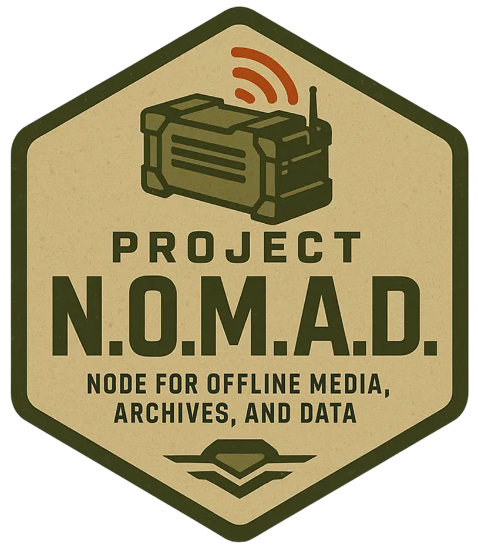

<div align="center">


# Project N.O.M.A.D.

### Node for Offline Media, Archives, and Data

**Knowledge That Never Goes Offline**

[](https://www.projectnomad.us)
[](https://discord.com/invite/crosstalksolutions)
[](https://benchmark.projectnomad.us)

</div>

---

Project N.O.M.A.D. is a self-contained, offline-first knowledge and education server packed with critical tools, knowledge, and AI to keep you informed and empowered—anytime, anywhere.

## Installation & Quickstart

Project N.O.M.A.D. can be installed on any Debian-based operating system (we recommend Ubuntu). Installation is completely terminal-based, and all tools and resources are designed to be accessed through the browser, so there's no need for a desktop environment if you'd rather setup N.O.M.A.D. as a "server" and access it through other clients.

_Note: sudo/root privileges are required to run the install script_

### Quick Install (Debian-based OS Only)

```bash
sudo apt-get update && \
sudo apt-get install -y curl && \
curl -fsSL https://raw.githubusercontent.com/Crosstalk-Solutions/project-nomad/refs/heads/main/install/install_nomad.sh \
  -o install_nomad.sh && \
sudo bash install_nomad.sh
```

Project N.O.M.A.D. is now installed on your device! Open a browser and navigate to `http://localhost:8080` (or `http://DEVICE_IP:8080`) to start exploring!

For a complete step-by-step walkthrough (including Ubuntu installation), see the [Installation Guide](https://www.projectnomad.us/install).

### Advanced Installation

For more control over the installation process, copy and paste the [Docker Compose template](https://raw.githubusercontent.com/Crosstalk-Solutions/project-nomad/refs/heads/main/install/management_compose.yaml) into a `docker-compose.yml` file and customize it to your liking (be sure to replace any placeholders with your actual values). Then, run `docker compose up -d` to start the Command Center and its dependencies. Note: this method is recommended for advanced users only, as it requires familiarity with Docker and manual configuration before starting.

## How It Works

N.O.M.A.D. is a management UI ("Command Center") and API that orchestrates a collection of containerized tools and resources via [Docker](https://www.docker.com/). It handles installation, configuration, and updates for everything — so you don't have to.

**Built-in capabilities include:**

- **AI Chat with Knowledge Base** — local AI chat powered by [Ollama](https://ollama.com/) or you can use OpenAI API compatible software such as LM Studio or llama.cpp, with document upload and semantic search (RAG via [Qdrant](https://qdrant.tech/))
- **Information Library** — offline Wikipedia, medical references, ebooks, and more via [Kiwix](https://kiwix.org/)
- **Education Platform** — Khan Academy courses with progress tracking via [Kolibri](https://learningequality.org/kolibri/)
- **Offline Maps** — downloadable regional maps via [ProtoMaps](https://protomaps.com)
- **Data Tools** — encryption, encoding, and analysis via [CyberChef](https://gchq.github.io/CyberChef/)
- **Notes** — local note-taking via [FlatNotes](https://github.com/dullage/flatnotes)
- **System Benchmark** — hardware scoring with a [community leaderboard](https://benchmark.projectnomad.us)
- **Health Dashboard** — per-tool storage, per-container RAM, uptime, and last ZIM update in System Information
- **Easy Setup Wizard** — guided first-time configuration with curated content collections
- **Hardware Readiness Check** — first-boot SSD health, RAM, and GPU VRAM scoring with setup suggestions
- **Developer Caches** — optional npm, PyPI, and Docker Hub pull-through caches for air-gapped development
- **Local Voice Services** — optional Whisper.cpp speech-to-text and Piper text-to-speech containers
- **Offline Translation** — optional local Argos Translate models for map labels and wiki text
- **Backup & Restore** — compressed storage and MySQL archives to a second disk or an rclone remote
- **Cluster Sync** — pair two boxes and mirror selected ZIM files or offline map regions over a trusted LAN
- **Guest Kiosk** — classroom-safe mode with a dedicated launcher and an allowlist of tools instead of the admin UI

N.O.M.A.D. also includes built-in tools like a Wikipedia content selector, ZIM library manager, and content explorer.

Developer caches can be installed from **Settings → Developer Caches**. They fill on demand while
online and keep fetched packages or images on the N.O.M.A.D. storage disk for later offline use.

Whisper.cpp and Piper can be installed from **Settings → Apps** when local voice services are
needed. Whisper provides an HTTP transcription server on port `8400`; Piper provides a browser
test page on port `8401` and a Wyoming endpoint on port `8402`.

Chat history is scoped to the browser that created it using an encrypted, opaque browser key.
Use the **Private chat** toggle in the chat sidebar for conversations that should not be saved
to history; private conversations remain only in the open tab.

Offline Translation can be installed from **Settings → Apps**. It keeps selected Argos Translate
language packs on the storage disk and provides translation panels in the map and content managers
for text copied from offline maps and Kiwix articles.

Backups are managed from **Settings → Backup & Restore**. The standard compose file mounts the host
directory `/opt/project-nomad/backups` at `/backups`; set `NOMAD_BACKUP_PATH` in the compose `.env`
file to point that mount at a second disk. Each archive contains the Nomad storage directory and a
logical MySQL dump. Redis queues/cache state, container images, and host compose files are
intentionally excluded from the archive; environment secrets are recreated or configured
separately during recovery. Protect archives because application data and database settings may
contain sensitive values.

To enable an rclone destination, place the remote configuration in
`/opt/project-nomad/rclone/rclone.conf`, set `NOMAD_RCLONE_REMOTE` to a value such as
`s3:project-nomad/backups` in the compose `.env` file, and recreate the admin container. The
optional rclone integration uses the [rclone command line](https://rclone.org/docs/) inside the
admin image and supports listing, uploading, and restoring backup archives.

Cluster Sync is available from **Settings → Cluster Sync**. Generate one shared token, enter the
peer's Command Center URL and the same token on both boxes, then select the remote ZIM files or map
regions to mirror. Transfers are authenticated, size-checked, streamed to a temporary file, and
renamed into place only after the download completes. Pairing is intended for a trusted LAN; use
HTTPS or network isolation when appropriate.

To run a classroom deployment without the management UI, set `NOMAD_GUEST_MODE=true` in the
installation `.env` file. The default launcher exposes chat, maps, and local documentation. Set
`NOMAD_GUEST_TOOLS` to a comma-separated allowlist of `chat`, `maps`, `docs`, `kiwix`, `kolibri`,
`cyberchef`, or `flatnotes`; service tiles appear only when the corresponding service is installed.
Blocked management pages redirect to the kiosk launcher, and blocked APIs return `403` responses.

## What's Included

| Capability          | Powered By      | What You Get                                                   |
| ------------------- | --------------- | -------------------------------------------------------------- |
| Information Library | Kiwix           | Offline Wikipedia, medical references, survival guides, ebooks |
| AI Assistant        | Ollama + Qdrant | Built-in chat with document upload and semantic search         |
| Education Platform  | Kolibri         | Khan Academy courses, progress tracking, multi-user support    |
| Offline Maps        | ProtoMaps       | Downloadable regional maps with search and navigation          |
| Data Tools          | CyberChef       | Encryption, encoding, hashing, and data analysis               |
| Notes               | FlatNotes       | Local note-taking with markdown support                        |
| System Benchmark    | Built-in        | Hardware scoring, Builder Tags, and community leaderboard      |

## Device Requirements

While many similar offline survival computers are designed to be run on bare-minimum, lightweight hardware, Project N.O.M.A.D. is quite the opposite. To install and run the
available AI tools, we highly encourage the use of a beefy, GPU-backed device to make the most of your install.

At it's core, however, N.O.M.A.D. is still very lightweight. For a barebones installation of the management application itself, the following minimal specs are required:

_Note: Project N.O.M.A.D. is not sponsored by any hardware manufacturer and is designed to be as hardware-agnostic as possible. The harware listed below is for example/comparison use only_

#### Minimum Specs

- Processor: 2 GHz dual-core processor or better
- RAM: 4GB system memory
- Storage: At least 5 GB free disk space
- OS: Debian-based (Ubuntu recommended)
- Stable internet connection (required during install only)

To run LLM's and other included AI tools:

#### Optimal Specs

- Processor: AMD Ryzen 7 or Intel Core i7 or better
- RAM: 32 GB system memory
- Graphics: NVIDIA RTX 3060 or AMD equivalent or better (more VRAM = run larger models)
- Storage: At least 250 GB free disk space (preferably on SSD)
- OS: Debian-based (Ubuntu recommended)
- Stable internet connection (required during install only)

**For detailed build recommendations at three price points ($150–$1,000+), see the [Hardware Guide](https://www.projectnomad.us/hardware).**

Again, Project N.O.M.A.D. itself is quite lightweight - it's the tools and resources you choose to install with N.O.M.A.D. that will determine the specs required for your unique deployment

#### Running AI models on a different host

By default, N.O.M.A.D.'s installer will attempt to setup Ollama on the host when the AI Assistant is installed. However, if you would like to run the AI model on a different host, you can go to the settings of of the AI assistant and input a URL for either an ollama or OpenAI-compatible API server (such as LM Studio).  
Note that if you use Ollama on a different host, you must start the server with this option `OLLAMA_HOST=0.0.0.0`.  
Ollama is the preferred way to use the AI assistant as it has features such as model download that OpenAI API does not support. So when using LM Studio for example, you will have to use LM Studio to download models.
You are responsible for the setup of Ollama/OpenAI server on the other host.

## Frequently Asked Questions (FAQ)

For answers to common questions about Project N.O.M.A.D., please see our [FAQ](FAQ.md) page.

## About Internet Usage & Privacy

Project N.O.M.A.D. is designed for offline usage. An internet connection is only required during the initial installation (to download dependencies) and if you (the user) decide to download additional tools and resources at a later time. Otherwise, N.O.M.A.D. does not require an internet connection and has ZERO built-in telemetry.

To test internet connectivity, N.O.M.A.D. attempts to make a request to Cloudflare's utility endpoint, `https://1.1.1.1/cdn-cgi/trace` and checks for a successful response.

## About Security

By design, Project N.O.M.A.D. is intended to be open and available without hurdles - it includes no authentication. If you decide to connect your device to a local network after install (e.g. for allowing other devices to access it's resources), you can block/open ports to control which services are exposed.

**Will authentication be added in the future?** Maybe. It's not currently a priority, but if there's enough demand for it, we may consider building in an optional authentication layer in a future release to support uses cases where multiple users need access to the same instance but with different permission levels (e.g. family use with parental controls, classroom use with teacher/admin accounts, etc.). We have a suggestion for this on our public roadmap, so if this is something you'd like to see, please upvote it here: https://roadmap.projectnomad.us/posts/1/user-authentication-please-build-in-user-auth-with-admin-user-roles

For now, we recommend using network-level controls to manage access if you're planning to expose your N.O.M.A.D. instance to other devices on a local network. N.O.M.A.D. is not designed to be exposed directly to the internet, and we strongly advise against doing so unless you really know what you're doing, have taken appropriate security measures, and understand the risks involved.

## Contributing

Contributions are welcome and appreciated! Please see [CONTRIBUTING.md](CONTRIBUTING.md) for guidelines on how to contribute to the project.

## Community & Resources

- **Website:** [www.projectnomad.us](https://www.projectnomad.us) - Learn more about the project
- **Discord:** [Join the Community](https://discord.com/invite/crosstalksolutions) - Get help, share your builds, and connect with other NOMAD users
- **Benchmark Leaderboard:** [benchmark.projectnomad.us](https://benchmark.projectnomad.us) - See how your hardware stacks up against other NOMAD builds
- **Troubleshooting Guide:** [TROUBLESHOOTING.md](TROUBLESHOOTING.md) - Find solutions to common issues
- **FAQ:** [FAQ.md](FAQ.md) - Find answers to frequently asked questions

## License

Project N.O.M.A.D. is licensed under the [Apache License 2.0](LICENSE).

## Helper Scripts

Once installed, Project N.O.M.A.D. has a few helper scripts should you ever need to troubleshoot issues or perform maintenance that can't be done through the Command Center. All of these scripts are found in Project N.O.M.A.D.'s install directory, `/opt/project-nomad`

###

###### Start Script - Starts all installed project containers

```bash
sudo bash /opt/project-nomad/start_nomad.sh
```

###

###### Stop Script - Stops all installed project containers

```bash
sudo bash /opt/project-nomad/stop_nomad.sh
```

###

###### Update Script - Attempts to pull the latest images for the Command Center and its dependencies (i.e. mysql) and recreate the containers. Note: this _only_ updates the Command Center containers. It does not update the installable application containers - that should be done through the Command Center UI

```bash
sudo bash /opt/project-nomad/update_nomad.sh
```

###### Uninstall Script - Need to start fresh? Use the uninstall script to make your life easy. Note: this cannot be undone!

```bash
curl -fsSL https://raw.githubusercontent.com/Crosstalk-Solutions/project-nomad/refs/heads/main/install/uninstall_nomad.sh -o uninstall_nomad.sh && sudo bash uninstall_nomad.sh
```
